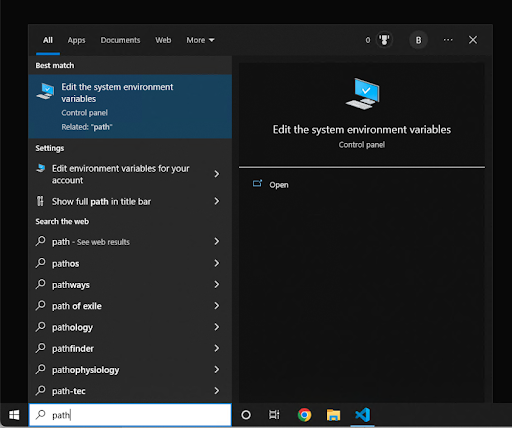
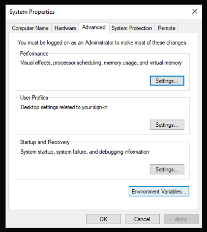
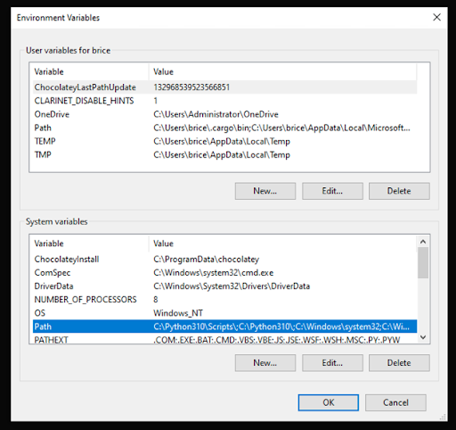
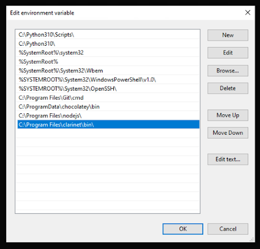

#### **How to use Command line tools?**

People unfamiliar with the command line tools will install the clarity extension in VSCode and then type `clarity new <project name>` in the editor window and not know what to do next. Maybe we could add some clarifications about how to use command line tools. 

Also, adding more functionality to the extension will be helpful so that eventually, they don’t need to use the command line if they don’t want to.

#### **After installing Clarinet with the installer, how can I run Clarinet?**

- First, restart your shell/VSCode to ensure they have the updated Path (the installer should have added the directory to the path).
- If that does not work, manually add the directory to your Path by following the steps below:

    -  Open "System Properties", select "Environment Variables" button, under "System variables", select "Path" and hit "Edit". 
    - Press the "New" button and add "C:\Program Files\clarinet\bin", then press Ok, Ok, Ok. 
    - Finally, restart your shell or VSCode.
    - If you did not install to the default directory, modify the path accordingly.

Below are some screenshots to help with this:

#### **The command `clarinet integrate` is not working. How can I fix it?**

Check for rootless docker installation.
